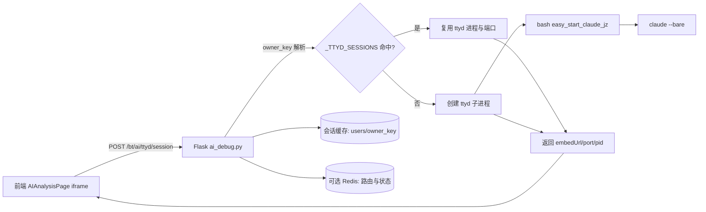
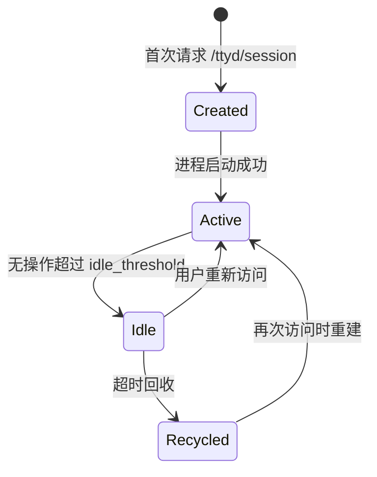

# AI 多用户架构设计（ttyd + 进程 + 缓存）

## 1. 目标与范围

本设计用于 `management-system` 的 AI 能力多用户化，覆盖：

- 多用户会话隔离（基于 `owner_key`）
- ttyd 终端接入与进程管理
- 会话缓存与长期记忆分层
- 单机到多实例的平滑演进
- 向后兼容当前单用户缓存结构

非目标（当前阶段不做）：

- 自动化归档清理策略的复杂编排
- 跨区域多活一致性
- 完整计费系统

---

## 2. 核心设计原则

- 按 `owner_key` 强隔离（进程、目录、缓存键都隔离）
- 按需创建子进程，不做预热进程池
- 会话短状态放内存，恢复状态落盘/Redis
- 写入原子化，避免并发损坏
- 保留 `default` 用户，兼容单用户历史逻辑

---

## 3. 总体架构图



---

## 4. 关键模块设计

### 4.1 API 层（`ai_debug.py`）

入口：

- `POST /bt/ai/ttyd/session`

逻辑：

1. 从请求中解析 `owner_key`（无则回退 `default`）
2. 检查内存映射 `_TTYD_SESSIONS[owner_key]`
3. 存活则复用；不存在或已退出则拉起新进程
4. 返回 `embedUrl + ownerKey + model + port + pid`

### 4.2 ttyd 与 Claude 子进程

- 一条活跃会话对应一条 `ttyd -> easy_start_claude_jz -> claude` 链路
- `owner_key` 决定端口映射（优先固定、冲突时顺延）
- 进程创建使用独立进程组，便于统一回收

### 4.3 缓存层（按用户目录隔离）

建议目录：

```text
ai/cache/
├── users/
│   ├── {owner_hash_or_safe_key}/
│   │   ├── metadata.json
│   │   ├── user_info.json
│   │   └── conversations/
│   │       └── {conversation_id}.json
│   └── ...
└── metadata.json   # 仅兼容入口/迁移标记，不再承载真实全局会话
```

说明：

- 不建议直接使用原始 `owner_key` 作为目录名，建议安全化（见 6.1）
- 每个用户目录首次访问自动创建

---

## 5. 数据模型建议

### 5.1 用户级 metadata

`users/{owner}/metadata.json`

```json
{
  "schema_version": 1,
  "owner_key": "raw-or-masked",
  "current_conversation_id": "conv_xxx",
  "last_access_at": 1710000000,
  "updated_at": 1710000000,
  "active_ttyd_port": 8891,
  "active_pid": 12345,
  "model": "MiniMax-M2.7"
}
```

### 5.2 对话文件

`users/{owner}/conversations/{conv_id}.json`

```json
{
  "conversation_id": "conv_xxx",
  "owner_key": "raw-or-masked",
  "created_at": 1710000000,
  "updated_at": 1710000300,
  "messages": [
    {"role": "user", "content": "...", "ts": 1710000001},
    {"role": "assistant", "content": "...", "ts": 1710000002}
  ],
  "summary": "最近对话摘要",
  "token_estimate": 1234
}
```

---

## 6. 隔离与安全设计

### 6.1 owner_key 安全化

推荐：

1. 原始 `owner_key` 保留在业务层用于鉴权
2. 文件系统路径使用 `safe_owner = sha256(owner_key).hexdigest()[:24]`
3. 在索引文件维护 `safe_owner -> owner_key(masked)` 映射（可选）

收益：

- 防止路径穿越、特殊字符污染、超长路径问题
- 避免直接暴露用户真实标识到文件名

### 6.2 访问控制

- 所有缓存读写前都要完成认证并确认请求人 == `owner_key`
- 任何列表接口默认只返回当前用户数据；管理员接口需显式权限

### 6.3 敏感信息处理

- API key 不落入会话缓存
- 日志对用户输入做长度与关键字段脱敏

---

## 7. 生命周期与回收

### 7.1 会话生命周期



### 7.2 回收策略（推荐初始值）

- `idle_threshold`: 15 分钟
- `sweep_interval`: 60 秒
- `max_sessions_global`: 100（按机器规格调整）
- `max_sessions_per_user`: 2（防止单用户占满资源）

回收动作：

1. 发送 `SIGTERM` 到会话进程组
2. 更新用户 metadata（`active_pid/port = null`）
3. 记录审计日志

---

## 8. 单机与多实例部署

### 8.1 单机（当前可直接落地）

- `_TTYD_SESSIONS` 内存映射管理活跃会话
- 文件缓存存 `ai/cache/users/...`
- 定时线程扫超时并回收

### 8.2 多实例（后续演进）

新增 Redis：

- `ai:routing:{owner}` -> `{instance_id, port, pid, updated_at}`
- `ai:lock:{owner}`（短锁，防止并发重复拉起）

策略：

- 网关层尽量 sticky 到同实例
- 非 sticky 场景下通过 Redis 路由到正确实例

---

## 9. 向后兼容与迁移

### 9.1 兼容策略

读：

1. 先读新路径 `users/{owner}/...`
2. 若 `owner=default` 且新路径不存在，回退旧路径

写：

- 新版本仅写新路径

### 9.2 迁移步骤

1. 发布支持新用户目录结构的运行时管理逻辑
2. 首次访问 `default` 时将旧 `conversations/` 迁入 `users/default/`
3. 观察稳定后将旧路径标记废弃

---

## 10. 观测与运维建议

指标：

- 活跃会话数、启动失败率、回收次数
- 平均会话时长、端口冲突次数
- 每用户会话数分布（P50/P95）

日志关键字段：

- `owner_key(masked)`、`pid`、`port`、`phase`、`elapsed_ms`

运维排障最小命令集合（示例）：

- 查 ttyd 进程数
- 查端口占用范围（`AI_TTYD_PORT_BASE ~ +SPAN`）
- 查某用户最近一次会话启动/回收日志

---

## 11. 实施计划（建议）

### Phase 1（本周）

- 用户目录与工作区按 `owner_key` 隔离
- 增加原子写与 `schema_version`
- 接入 `last_access_at` 更新

### Phase 2（下周）

- 增加 idle 回收任务
- 增加 `max_sessions_global/per_user` 限流
- 增加基础监控指标

### Phase 3（按需）

- 引入 Redis 路由（多实例）
- 增加用户记忆提炼（summary/memory）

---

## 12. 一句话结论

对当前系统最优解是：**按 `owner_key` 做“动态多进程 + 用户级缓存目录隔离 + 空闲回收”**，而不是预创建多进程池；先单机稳定，再平滑升级到 Redis 路由的多实例架构。

