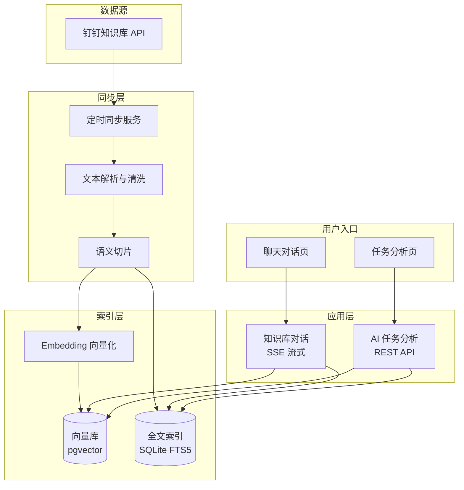
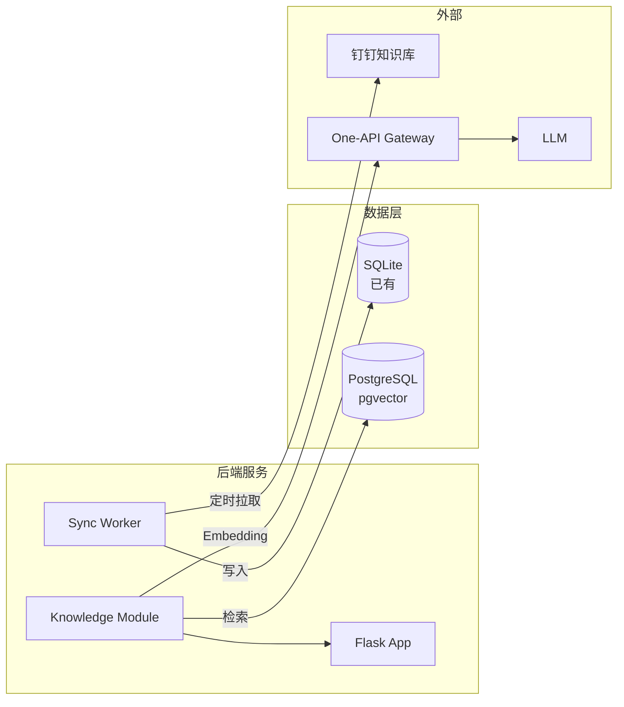

# 知识库 RAG 系统设计

## 1. 目标与范围

将钉钉知识库内容接入 AI 系统，支持两个场景：
1. **知识库对话模式** — 用户与 AI 自由对话，AI 基于知识库内容回答，不涉及任务创建
2. **AI 任务分析** — 在分析任务时自动引用知识库中的规范文档，辅助判断任务完整性和合规性

### 1.1 非目标（当前阶段不做）

- 知识库文档的在线编辑/管理
- 多模态内容理解（图片、表格等复杂格式降级处理）
- 知识库权限与钉钉侧的实时同步
- 对话历史持久化存储

---

## 2. 总体架构



---

## 3. 钉钉知识库同步

### 3.1 数据源调研（待验证）

钉钉知识库（文档应用）需确认以下 API 能力：

| 能力 | 是否支持 | 备注 |
|------|---------|------|
| 获取文档空间/目录列表 | 待验证 | 用于遍历所有文档 |
| 获取文档正文内容 | 待验证 | 核心能力，决定方案可行性 |
| 获取文档变更通知 | 待验证 | webhook 或轮询 |
| 按用户权限过滤 | 待验证 | 控制可同步的文档范围 |

如果 API 无法获取正文内容，备选方案：
- 手动导出知识库文档
- 通过钉钉开放平台的事件订阅接收变更

### 3.2 同步策略

```
┌─────────────────────────────────────┐
│  定时任务 (cron / APScheduler)        │
│                                     │
│  每天凌晨 2:00 全量同步               │
│  每 30 分钟增量同步（如 API 支持）      │
└──────────────────┬──────────────────┘
                   ▼
┌─────────────────────────────────────┐
│  文档内容处理流水线                    │
│                                     │
│  原始 HTML/富文本 → 清洗 → Markdown   │
│  提取标题、目录层级、元数据            │
└──────────────────┬──────────────────┘
                   ▼
┌─────────────────────────────────────┐
│  存储：                                │
│  - 原始文档表（doc_id, title, content,│
│    url, updated_at）                  │
│  - 文档分片表（chunk_id, doc_id,     │
│    content, embedding, fts_index）    │
└─────────────────────────────────────┘
```

### 3.3 文档存储模型

```sql
-- 文档原始表
CREATE TABLE kb_documents (
    id          INTEGER PRIMARY KEY AUTOINCREMENT,
    doc_id      TEXT    UNIQUE NOT NULL,    -- 钉钉知识库文档 ID
    title       TEXT    NOT NULL,           -- 文档标题
    url         TEXT,                       -- 原始链接
    space_id    TEXT,                       -- 所属空间
    directory   TEXT,                       -- 所在目录
    content     TEXT,                       -- 清洗后的 Markdown 正文
    synced_at   DATETIME DEFAULT CURRENT_TIMESTAMP
);

-- 文档分片表（带 FTS5 + 向量）
CREATE TABLE kb_chunks (
    id          INTEGER PRIMARY KEY AUTOINCREMENT,
    doc_id      TEXT    NOT NULL REFERENCES kb_documents(doc_id),
    chunk_index INTEGER NOT NULL,           -- 分片序号
    content     TEXT    NOT NULL,           -- 分片文本
    embedding   BLOB,                       -- 向量（pgvector 或 SQLite 扩展）
    token_count INTEGER,                    -- token 数，用于控制检索量
    created_at  DATETIME DEFAULT CURRENT_TIMESTAMP
);

-- FTS5 全文索引
CREATE VIRTUAL TABLE kb_chunks_fts USING fts5(
    content, content=kb_chunks, content_rowid=id
);
```

---

## 4. 文档切片策略

### 4.1 切片规则

按层级切片，保留文档结构：

```
一级标题 (# 标题)
├── 二级标题 (## 标题)
│   ├── 三级标题 (### 标题)
│   │   └── 正文段落...
│   └── 正文段落...
└── 二级标题
    └── ...
```

**切片规则：**
- 以 `##` 或 `###` 标题为切分点
- 每个切片 = 标题 + 其下的正文内容
- 如果正文过长（> 500 token），再按段落切分，保留标题前缀
- 如果正文过短（< 50 token），与相邻切片合并

**目的：** 保证每个切片的语义完整性，检索时能连同标题一起召回，便于 LLM 理解上下文。

---

## 5. 知识库对话模式

### 5.1 交互流程

```
用户发送消息
    │
    ▼
[1] 意图判断：是否与知识库相关？
    ├─ 否 → 通用闲聊（拒答或简单回复）
    └─ 是 → 进入 RAG 流程
              │
              ▼
[2] 混合检索：
    ├─ 语义检索：用户问题 → Embedding → 向量库 top-N
    └─ 关键词检索：用户问题 → FTS5 全文索引 top-N
              │
              ▼
[3] 结果融合与重排序
    └─ 合并、去重、按相关性得分排序 → 取 top-K
              │
              ▼
[4] 构造 Prompt
    └─ System: 知识库引用片段 + 角色设定
       User: 用户原始问题 + 历史对话摘要
              │
              ▼
[5] LLM 生成回答（SSE 流式返回）
    └─ 回答中标注引用来源：[来源：文档标题]
              │
              ▼
[6] 前端展示流式回答 + 引用标记
```

### 5.2 检索参数

| 参数 | 默认值 | 说明 |
|------|--------|------|
| 向量检索 top-N | 20 | 语义相似度最高的片段 |
| 全文检索 top-N | 10 | 关键词匹配的片段 |
| 最终 top-K | 8 | 重排序后取前 K 个片段 |
| 单片段最大 token | 800 | 超长切片截断 |
| 总召回 token 上限 | 4000 | 控制 prompt 长度 |

### 5.3 Prompt 结构

```text
你是一个企业内部知识助手，基于以下知识库内容回答用户问题。
请用中文回答，语言简洁准确。如果知识库内容不足以回答问题，
请明确告知，不要编造信息。

知识库内容：
---
[来源：XX规范（v2.3）]
{碎片内容...}

[来源：YY操作手册]
{碎片内容...}
---

请回答以下问题：
{用户问题}
```

### 5.4 多轮对话处理

```
首次对话
  → 检索 + 生成（完整流程）

第 N 轮对话
  → 将最近 2 轮对话内容 + 当前问题拼接为完整查询
  → 重新检索（每次基于最新问题检索，保证召回相关性）
  → 生成回答
```

关键点：**不缓存检索结果**，每轮对话独立检索。多轮上下文仅用于 LLM 生成，不用于检索。

---

## 6. AI 任务分析

### 6.1 流程

```
用户触发任务分析（选择任务/项目）
    │
    ▼
[1] 从 DB 拉取任务数据（工时、进度、逾期等）
    │
    ▼
[2] 根据任务类型 + 项目信息，检索知识库
    └─ 关键词构建：[项目名/业务类型 + "规范"、"流程"、"要求"]
    └─ 筛选条件：空间/目录限定
    │
    ▼
[3] 构造分析 Prompt
    └─ 任务数据 + 知识库规范 + 分析规则
    │
    ▼
[4] LLM 生成分析报告（非流式，全量 JSON 返回）
    └─ 合规检查、风险评估、改进建议
```

### 6.2 非流式返回

分析结果不需要流式，走 REST API：

```json
POST /ai/analyze_task
{
    "task_id": "xxx",
    "project_id": "yyy"
}

→ 200 Response
{
    "summary": "任务整体评分良好，但需求描述不够完整",
    "metrics": {
        "task_completeness": 0.7,
        "合规项数": 8,
        "不达标项数": 1
    },
    "risks": [
        "缺少验收标准，建议补充"
    ],
    "suggestions": [
        "建议参考《需求文档规范》第3节补充验收标准"
    ],
    "evidence": [
        {
            "source": "需求文档规范 v2.3",
            "content": "所有任务必须包含明确的验收标准..."
        }
    ]
}
```

---

## 7. API 设计

### 7.1 知识库对话

```
SSE GET /ai/knowledge/chat
    ?q=用户问题
    &session_id=xxx

→ event: message
  data: {"type": "text", "content": "部分回答..."}
→ event: message
  data: {"type": "citation", "source": "文档标题"}
→ event: done
```

会话管理：
- `session_id` 由前端生成并传递
- 后端根据 `session_id` 维护最近 N 轮对话历史（内存缓存，TTL 30 分钟）
- 无 session 持久化，页面关闭即丢失

### 7.2 知识库管理

```
GET  /ai/knowledge/documents       — 文档列表（分页）
POST /ai/knowledge/sync            — 手动触发同步
GET  /ai/knowledge/sync/status     — 同步状态查询
```

### 7.3 AI 任务分析

```
POST /ai/analyze_task              — 任务分析（如上）
```

---

## 8. 技术选型

### 8.1 向量库选择

| 方案 | 优势 | 劣势 | 推荐度 |
|------|------|------|--------|
| pgvector（PostgreSQL） | 成熟稳定，支持 SQL + 向量混合查询 | 需要额外部署 PostgreSQL | ⭐⭐⭐ |
| Chroma | 轻量，嵌入式部署 | 功能有限，生产案例少 | ⭐⭐ |
| SQLite + vec0 | 零部署，与现有 SQLite 一致 | 生态较新，功能较少 | ⭐⭐ |
| Milvus | 性能强，功能全 | 部署重，运维成本高 | ⭐ |

**推荐：pgvector**（如果已用 MySQL，可在同一台机器上用 Docker 起一个 PostgreSQL 实例专门做向量检索）。

如果 PostgreSQL 不方便引入，退而求其次用 **SQLite + vec0 扩展**，与现有 SQLite 文件放在一起。

### 8.2 Embedding 模型

通过现有的 One-API 网关调用，不需要额外部署模型服务：

```
POST {one-api-base-url}/v1/embeddings
{
    "model": "text-embedding-3-small",   // 或其他支持的 embedding 模型
    "input": "文档切片内容..."
}
```

如果 One-API 不支持 embedding 模型，备选方案：使用 `MiniMax` 或 `step` 等平台的 embedding 接口。

---

## 9. 目录结构

```
backend/ai/
├── knowledge/                    # 知识库模块
│   ├── __init__.py
│   ├── routes.py                # API 路由（对话 + 管理）
│   ├── sync.py                  # 定时同步服务
│   ├── parser.py                # 文档解析与清洗
│   ├── chunker.py               # 语义切片
│   ├── embedder.py              # Embedding 调用
│   ├── retriever.py             # 混合检索
│   ├── chat.py                  # 对话生成（SSE）
│   └── chat_session.py          # 对话历史管理
├── analysis/                    # 已有分析模块（增强）
│   ├── routes.py                # API 路由（新增分析接口）
│   └── service.py               # 分析服务（增强：接入知识库）
├── docs/
│   └── knowledge_base_rag.md    # 本文档
└── ...
```

---

## 10. 部署与数据流转



---

## 11. 分阶段实施计划

### Phase 1：数据源验证（1-2 天）

- 调研钉钉知识库 API，确认能否获取文档列表和正文
- 如果 API 不可行，确定替代方案

### Phase 2：文档同步与索引（3-5 天）

- 实现定时同步服务
- 文档解析清洗（HTML/富文本 → Markdown）
- 语义切片
- 写入 SQLite 全文索引

### Phase 3：知识库对话（5-7 天）

- 实现混合检索（FTS5 + 向量）
- 实现 SSE 流式对话接口
- 前端聊天组件接入
- 多轮对话支持

### Phase 4：任务分析增强（3-5 天）

- 在现有分析流程中接入知识库检索
- 分析报告中增加引用来源

---

## 12. 风险与应对

| 风险 | 影响 | 应对 |
|------|------|------|
| 钉钉知识库无内容导出 API | 方案不可行 | 提前预研，备选方案：用户手动导出 + 上传 |
| 文档格式复杂（表格、图片） | 解析质量差 | 表格转 markdown 表格，图片暂忽略 |
| 知识库量大，检索质量下降 | 回答不准确 | 混合检索 + 重排序，持续调优切片策略 |
| 对话模式延迟高 | 用户体验差 | SSE 流式逐步返回，检索阶段控制在 500ms 内 |
